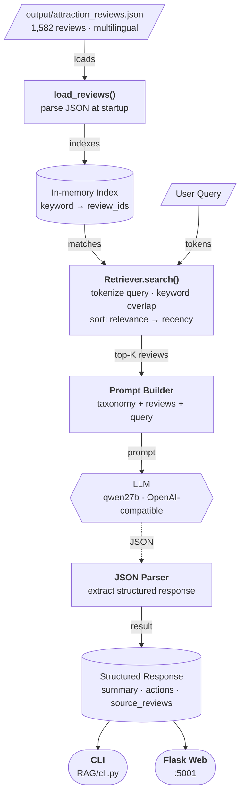

# jojani_ai

Review analysis pipeline: extract → classify → LLM judge.

## Architecture


## Project Structure

```
jojani_ai/
├── data/
│   ├── Booking_reviews.csv           # Raw reviews (source)
│   ├── booking_attractions_reviews.csv
│   └── places_data.csv              # Place name keywords
├── src/
│   ├── __init__.py
│   ├── config.py                    # Env loading, LLM settings, file paths
│   ├── llm.py                       # call_llm() — single LLM client
│   ├── prompts.py                   # Review-judgement prompt template
│   ├── parse_reviews.py             # Markdown parsers (shared)
│   ├── extract_reviews.py           # Step 1: CSV → reviews.md
│   ├── classify_reviews.py          # Step 2: Filter by place keywords
│   ├── llm_judge.py                 # Step 3 (CLI): LLM judgement → judge_results.md
│   └── web/
│       ├── __init__.py
│       ├── app.py                   # Step 3 (web): Flask routes
│       └── templates/
│           └── index.html           # Frontend (button, progress bar, results)
├── output/                          # Generated files (gitignored)
│   ├── reviews.md
│   ├── matched_reviews.md
│   ├── judge_results.md
│   └── judgements.csv
├── .env                             # LLM config (gitignored)
├── .gitignore
└── requirements.txt
```

## Prerequisites

- Python 3.10+
- Dependencies:

```bash
pip install -r requirements.txt
```

## Setup

Fill in your LLM credentials in `.env`:

```
LLM_URL=https://your-endpoint/v1/chat/completions
LLM_API_KEY=sk-your-key
LLM_MODEL=your-model-name
```

All configuration lives in `src/config.py`. Adjust `BATCH_SIZE` or `MAX_RETRIES` there if needed.

## How to Run

All CLI commands are run from the project root.

### Step 1 — Extract reviews

```bash
python -m src.extract_reviews
```

Reads `data/Booking_reviews.csv`, writes `output/reviews.md`.

### Step 2 — Classify by place name

```bash
python -m src.classify_reviews
```

Filters `output/reviews.md` for reviews mentioning places in `data/places_data.csv`, writes `output/matched_reviews.md`.

### Step 3 — LLM Judgement

**Option A — CLI:**

```bash
python -m src.llm_judge
```

Writes `output/judge_results.md` (markdown with negative reviews + action items).

**Option B — Web UI:**

```bash
python -m src.web.app
```

Then open http://localhost:5000 and click **"Run Judgement"**. Results are saved to `output/judgements.csv`:

| Column          | Description                          |
|-----------------|--------------------------------------|
| `location_name` | Place name from the review           |
| `judgement`     | One-sentence reason (why negative)   |
| `action`        | Semicolon-joined actionable fixes    |

## RAG — Ask about attraction issues

A retrieval-augmented app over the attraction-review knowledge base
(`output/attraction_reviews.json`, ~1,582 reviews). You ask a question about any issue;
the app retrieves the most relevant reviews, then the LLM classifies them into a
**canonical English taxonomy**, summarises findings, and returns specific actions with
the raw reviews as evidence.

### Architecture



### Project Structure

```
RAG/
├── __init__.py
├── config.py         # .env loading, taxonomy, LLM settings
├── retriever.py      # keyword-based filter (no ML deps)
├── llm.py            # OpenAI-compatible LLM client + retry
├── rag.py            # engine: retrieve → prompt → LLM → structured dict
├── cli.py            # CLI / interactive REPL
└── web/
    ├── app.py        # Flask on :5001
    └── templates/
        └── index.html
```

### How it works

1. **Retrieve** — tokenize the query, find reviews with keyword overlap (no embeddings,
   no vector DB), sort by relevance then recency, take top 15.
2. **Classify** — LLM assigns each review to a canonical English taxonomy
   (e.g. `overpriced`, `poor_customer_service`, `unsafe`). Handles cross-lingual reviews
   natively (German, French, Spanish → same English labels).
3. **Respond** — structured JSON: `{summary, actions[], source_reviews[]}`.

### Canonical Taxonomy

| Label | Meaning |
|-------|---------|
| `venue_conditions_unpleasant` | Dirty, crowded, uncomfortable facilities |
| `poor_customer_service` | Rude, unhelpful, or absent staff |
| `overpriced` | Cost not justified by experience |
| `unsafe` | Safety hazards, security concerns |
| `accessibility_issues` | Mobility/access barriers |
| `poor_maintenance` | Broken, neglected infrastructure |
| `misleading_marketing` | Reality differs from description |
| `language_barrier` | Communication difficulties |
| `weather_related` | Weather impacted the experience |
| `logistics_problems` | Scheduling, transport, coordination issues |
| `positive_highlight` | Praise worth reinforcing |
| `other` | Doesn't fit above |

### Usage

**CLI** (run from project root):

```bash
python3 RAG/cli.py "What do reviewers say about tour guides?"
python3 RAG/cli.py "pricing complaints" --json
python3 RAG/cli.py --interactive
```

**Web UI** (requires `flask`):

```bash
python3 RAG/web/app.py        # open http://localhost:5001
```

### Response Format

```json
{
  "summary": "Reviews about Stone Town tours are overwhelmingly positive on guide quality, but 3 mention overcrowding and 2 flag pricing.",
  "actions": [
    "Consider tiered pricing",
    "Add accessibility notes to listing"
  ],
  "source_reviews": [
    {
      "attraction_id": "PR0iMwj9mmvd",
      "date": "2026-02-09",
      "rating": 5.0,
      "review_text": "Very knowledgeable and professional guide!..."
    }
  ]
}
```

### Configuration

RAG-specific settings live in `RAG/config.py`:

| Constant | Default | Description |
|----------|---------|-------------|
| `KNOWLEDGE_BASE` | `output/attraction_reviews.json` | Review JSON path |
| `MAX_REVIEWS` | `15` | Max reviews passed to LLM per query |
| `TAXONOMY` | 12 labels | Canonical issue categories |

LLM settings (`LLM_URL`, `LLM_API_KEY`, `LLM_MODEL`) are shared with the main pipeline via `.env`.

## Configuration

| Variable (`.env`)  | Description                  |
|--------------------|------------------------------|
| `LLM_URL`          | OpenAI-compatible endpoint   |
| `LLM_API_KEY`      | API key                      |
| `LLM_MODEL`        | Model identifier             |

Runtime settings (batch size, retry count, timeout) are defined as constants in `src/config.py`.
RAG-specific settings (`MAX_REVIEWS`, `TAXONOMY`) live in `RAG/config.py`.
