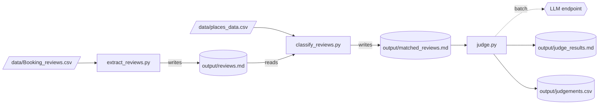
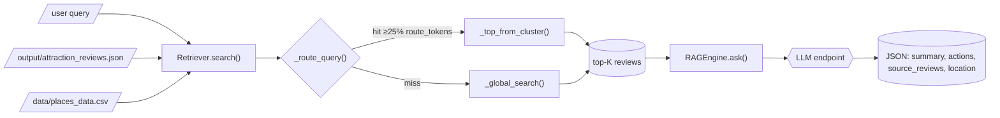

# jojani_ai

A suite of tools for analyzing Booking.com-style reviews. Two independent, self-contained components share the same data and LLM configuration but are otherwise decoupled:

| Component | Location | Entry point (CLI) | Entry point (Web) | What it does |
|-----------|----------|-------------------|-------------------|--------------|
| Review Analysis Pipeline | `keyword_based/` | `python -m keyword_based.llm_judge` | `python -m keyword_based.web.app` (:5000) | 3-step pipeline: extract → classify → LLM judge. Flags negative reviews for specific places and produces actionable fixes. |
| RAG Review Analyst | `RAG/` | `python RAG/cli.py "query"` | `python RAG/web/app.py` (:5001) | Keyword-based retrieval + LLM classification/summary for ad-hoc review queries. No embeddings. |

Both components use an OpenAI-compatible LLM endpoint configured via `.env` (`LLM_URL`, `LLM_API_KEY`, `LLM_MODEL`).

## Data

| File | Used by | Notes |
|------|---------|-------|
| `data/Booking_reviews.csv` | `keyword_based/` pipeline (step 1) | Raw guest reviews; column `Reviews`. |
| `data/places_data.csv` | `keyword_based/` pipeline (step 2) + `RAG/` | Place names for keyword filtering / place clustering. Single-column list, has duplicates/aliases/noise. |
| `output/attraction_reviews.json` | `RAG/` | Knowledge base: ~1582 reviews, ~265 attractions. Fields: `attraction_id`, `date`, `rating`, `review_text`. No location field — only opaque `attraction_id`s. |

## Output folder

`output/` holds the generated artifacts of the pipeline and RAG components.

| File | Written by | Description |
|------|-----------|-------------|
| `reviews.md` | `keyword_based/` step 1 | All reviews extracted from `Booking_reviews.csv`, one `## Review N` section per row. |
| `matched_reviews.md` | `keyword_based/` step 2 | Subset of `reviews.md` mentioning a place from `places_data.csv`; one `## <Place Name>` section per place. |
| `judge_results.md` | `keyword_based/` step 3 (CLI) | LLM judgement of matched reviews: negative reviews flagged with specific, actionable fixes. |
| `judgements.csv` | `keyword_based/` step 3 (Web) | LLM judgement as a CSV; columns `location_name`, `judgement`, `action`. |
| `judgement_progress.json` | `keyword_based/` step 3 (Web) | Live progress tracker for a running web judgement: `running`, `total`, `done`, `start_time`, `message`. |
| `attraction_reviews.json` | (input to `RAG/`) | RAG knowledge base — see Data table above. |

---

# keyword_based/ — Review Analysis Pipeline

3-step pipeline: extract → classify → LLM judge.

## Pipeline Flow



## Steps

| Step | Command | Reads | Writes |
|------|---------|-------|--------|
| 1 | `python -m keyword_based.extract_reviews` | `Booking_reviews.csv` | `output/reviews.md` |
| 2 | `python -m keyword_based.classify_reviews` | `reviews.md` + `places_data.csv` | `output/matched_reviews.md` |
| 3 (CLI) | `python -m keyword_based.llm_judge` | `matched_reviews.md` | `output/judge_results.md` |
| 3 (Web) | `python -m keyword_based.web.app` → http://localhost:5000 | `matched_reviews.md` | `output/judgements.csv` |

## Module Map

| File | Role |
|------|------|
| `config.py` | Paths, LLM env vars, batch/retry constants |
| `llm.py` | `call_llm()` — single LLM client with retry; `parse_llm_json()` — strips code fences |
| `prompts.py` | `REVIEW_JUDGE_PROMPT` template + `build_judge_prompt()` |
| `parse_reviews.py` | Markdown section parser (shared), `load_keywords()` |
| `extract_reviews.py` | Step 1: CSV → markdown |
| `classify_reviews.py` | Step 2: keyword filter |
| `judge.py` | Step 3 core: batch-judge loop (shared by CLI + web) |
| `llm_judge.py` | Step 3 CLI entry point |
| `web/app.py` | Step 3 Flask entry point |

## Markdown File Format

All intermediate files use the same structure — `## ` sections with a title line and body:

```markdown
# Title

## Section Name
body text...

## Next Section
body text...
```

`parse_reviews._parse_md_sections(path, prefix)` splits on any `## ` header; the public wrappers pick the right prefix per file type.

---

# RAG/ — RAG Review Analyst

Retrieves the reviews most relevant to a query, then asks an LLM to classify and summarize them. Keyword-based retrieval — no embeddings.

## Files

| File             | Responsibility                                            |
|------------------|-----------------------------------------------------------|
| `config.py`      | Paths, LLM settings, taxonomy, review-count limit.        |
| `retriever.py`   | All retrieval: tokenization, place clustering, search.    |
| `rag.py`         | `RAGEngine.ask()` — the glue: retrieve → prompt → LLM.    |
| `llm.py`         | `call_llm()` — one POST to an OpenAI-compatible endpoint. |
| `cli.py`         | Command-line entry point.                                 |
| `web/app.py`     | Flask entry point (port 5001) + `templates/index.html`.   |

## Pipeline Flow



## The flow (one query)

```
query
  └─ Retriever.search()                 retriever.py
       ├─ _route_query()                try to match a place cluster
       │     └─ hit  → _top_from_cluster()  worst rating first, then recent
       │     └─ miss → _global_search()        keyword overlap across all reviews
       └─ → (top-K reviews, location_or_None)
  └─ RAGEngine.ask()                    rag.py
       ├─ build prompt from reviews
       ├─ call_llm()                    llm.py
       └─ parse JSON → {summary, actions, source_reviews, location}
```

## How retrieval picks reviews

1. **Tokenize** — lowercase, drop punctuation, drop words ≤2 chars and stopwords
   (`_STOP`).
2. **Route to a place** — a place "matches" only if it shares ≥25% of the query's
   tokens with the place's *distinguishing* tokens (`route_tokens`), which exclude
   generic words like "farm" (`_GENERIC`). No match → global keyword search.
3. **Rank** — cluster path sorts by rating ascending (most actionable) then date
   descending; global path ranks by token-overlap count, then rating.

## Run it

```bash
python RAG/cli.py "your query"            # one query
python RAG/cli.py --interactive           # REPL
python RAG/cli.py "your query" --json     # raw JSON
python RAG/web/app.py                     # web UI on :5001
```

Set `LLM_URL`, `LLM_API_KEY`, `LLM_MODEL` in `.env` (or environment).

## Debugging

- To see exactly which place a query routed to (or that it fell back to global
  search), instantiate with the debug flag:
  `Retriever(_debug=True)` — it prints one line per `search()` call.
- The knowledge base is `output/attraction_reviews.json`; place names come from
  `data/places_data.csv` (optional — without it, retrieval is plain keyword search).
