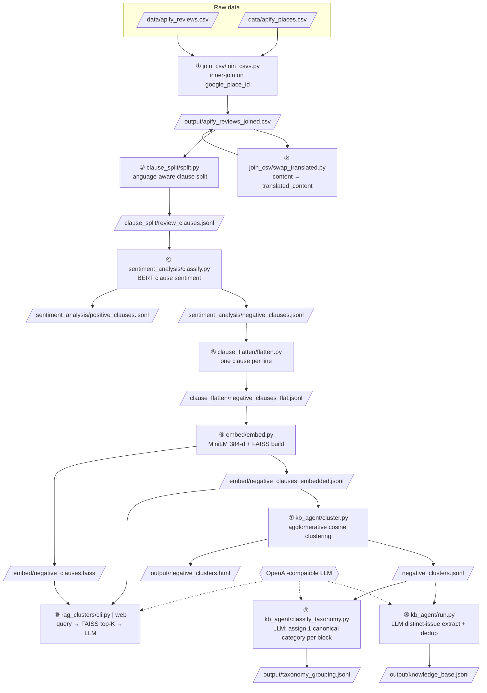

# jojani_ai — Multilingual Review Analysis Pipeline

A 10-stage pipeline that ingests tourist-attraction reviews scraped from Google (via Apify), splits them into atomic clauses, classifies each clause by sentiment with a local BERT model, embeds the negative clauses with a multilingual MiniLM encoder, clusters them into a scored knowledge base with taxonomy grouping (kb_agent), and answers natural-language questions about them using FAISS + LLM (RAG).

All models run locally (no cloud inference except the LLM for the final answer).

---

## Data Flow

```
data/
  apify_reviews.csv          ← raw reviews (one row per review, has translated_content)
  apify_places.csv           ← place metadata (place_name, coords, type, island)
       │
       ▼
join_csv/                    ① Inner-join reviews + places on google_place_id
       │
       ▼
output/apify_reviews_joined.csv
       │
       ▼
join_csv/                    ② (optional) Swap content ← translated_content (English)
       │
       ▼
clause_split/                ③ Split each review into atomic clauses (regex, multilingual)
       │
       ▼
clause_split/review_clauses.jsonl   one review per line, clauses nested
       │
       ▼
sentiment_analysis/          ④ BERT sentiment: split clauses → negative / positive
       │
       ├──► sentiment_analysis/negative_clauses.jsonl
       │         │
       │         ▼
       │    clause_flatten/        ⑤ Flatten negative clauses → one clause per line
       │         │
       │         ▼
       │    clause_flatten/negative_clauses_flat.jsonl
       │         │
       │         ▼
       │    embed/                 ⑥ MiniLM embed + FAISS index build
       │         │
       │         ▼
       │    embed/negative_clauses_embedded.jsonl  (clauses + 384-d vectors)
       │    embed/negative_clauses.faiss            (search index)
       │         │
       │         ├──► kb_agent/    ⑦ ⑧ ⑨ Cluster → LLM KB → taxonomy grouping
       │         │      │
       │         │      ▼
       │         │    negative_clusters.jsonl  →  output/knowledge_base.jsonl
       │         │                                output/taxonomy_grouping.jsonl
       │         │
       │         ▼
       │    rag_clusters/      ⑩ RAG: query → FAISS retrieve top-K clauses → LLM
       │                        Returns {summary, actions[], source_clauses[]}
       │
       └──► (positive_clauses.jsonl — unused downstream in this pipeline)
```

### Block diagram

Shape legend: ▱ parallelogram = raw data input, ⬭ cylinder = file artifact produced,
▭ rectangle = processing step, ⬡ hexagon = external LLM service.



> The RAG branch (⑩) reads the FAISS index + embedded clauses, retrieves the
> top-K matching complaints and returns a live `{summary, actions[],
> source_clauses[]}` dict — it does not write a file. The kb_agent branch
> (⑦–⑨) is the one that produces the pipeline's final persistent outputs
> (`knowledge_base.jsonl`, `taxonomy_grouping.jsonl`, plus the optional
> UMAP scatter `negative_clusters.html`).

### Pipeline as files (I/O only)

Every stage is just a file transformation. The two branches fork at stage ⑥'s
outputs: the **RAG branch (⑩)** reads the FAISS *index* for live retrieval,
while the **kb_agent branch (⑦→⑧→⑨)** reads the *embedded vectors* to build
grouped, persisted knowledge-base files.

```
data/apify_reviews.csv ─┐
                        ├─①→ output/apify_reviews_joined.csv ─②→ (same, translated)
data/apify_places.csv ──┘                                            │
                                                                    ③
                                                       clause_split/review_clauses.jsonl
                                                                    │
                                                                    ④
                                    ┌───────────────────────────────┴──────────────────┐
                         sentiment_analysis/negative_clauses.jsonl      sentiment_analysis/positive_clauses.jsonl
                                                                    │ (unused)
                                                                    ⑤
                                     clause_flatten/negative_clauses_flat.jsonl
                                                                    │
                                                                    ⑥
                       ┌────────────────────────────────────────────┴─────────────────────┐
              embed/negative_clauses_embedded.jsonl                              embed/negative_clauses.faiss
                       │  (⑦ cluster)                                            │
              negative_clusters.jsonl                                            │
                       │                                                        ⑩ RAG → {summary, actions[], source_clauses[]} (no file)
              ┌────────┴────────┐
         ⑧ run.py          ⑨ classify_taxonomy.py
              │                 │
   output/knowledge_base.jsonl   output/taxonomy_grouping.jsonl
                                      │
                            visualize_taxonomy.py → output/taxonomy_grouping.html
```

| Stage | Input file(s) | Output file(s) | What the output denotes |
|---|---|---|---|
| **① join** | `data/apify_reviews.csv` + `data/apify_places.csv` | `output/apify_reviews_joined.csv` | Reviews inner-joined with their place (name/coords attached) |
| **② swap** | `output/apify_reviews_joined.csv` | `output/apify_reviews_joined.csv` (in place) | Same file; `content` now the English translation |
| **③ split** | `output/apify_reviews_joined.csv` | `clause_split/review_clauses.jsonl` | One review per line, nested `clauses[]` |
| **④ sentiment** | `clause_split/review_clauses.jsonl` | `sentiment_analysis/negative_clauses.jsonl` | Reviews with negative clauses (BERT < threshold) |
| | | `sentiment_analysis/positive_clauses.jsonl` | Reviews with positive clauses (**unused downstream**) |
| **⑤ flatten** | `sentiment_analysis/negative_clauses.jsonl` | `clause_flatten/negative_clauses_flat.jsonl` | One flat clause per line |
| **⑥ embed** | `clause_flatten/negative_clauses_flat.jsonl` | `embed/negative_clauses_embedded.jsonl` | Each negative clause + 384-d `embedding` |
| | | `embed/negative_clauses.faiss` | `IndexFlatIP` search index (top-K retrieval) |
| **⑦ cluster** | `embed/negative_clauses_embedded.jsonl` | `negative_clusters.jsonl` | ~944 blocks — semantically similar clauses grouped (`clauses`, `place_names`, `size`) |
| **⑧ build KB** | `negative_clusters.jsonl` | `output/knowledge_base.jsonl` | Per block: LLM distinct `issues[]` (each `importance` 0–10), deduped |
| **⑨ taxonomy** | `negative_clusters.jsonl` | `output/taxonomy_grouping.jsonl` | One line per category: `category`, `category_label`, `block_count`, `blocks[]` |
| | (resumable) | `output/.taxonomy_cache.json` | Per-block `(category, block_name)` checkpoint |
| **visualize** | `embed/negative_clauses_embedded.jsonl` | `output/negative_clusters.html` | UMAP 2-D scatter of blocks |
| **visualize_taxonomy** | `output/taxonomy_grouping.jsonl` | `output/taxonomy_grouping.html` | Interactive drill-down per category |
| **⑩ RAG** | `embed/negative_clauses.faiss` + `embed/negative_clauses_embedded.jsonl` | *(none — in-memory dict)* | `{summary, actions[], source_clauses[]}` |

### `negative_clusters.jsonl` vs `knowledge_base.jsonl`

Both are produced by kb_agent from the same blocks, but they hold different
things — one is the *grouped raw evidence*, the other is the *distilled
insight*:

| | `negative_clusters.jsonl` (⑦) | `output/knowledge_base.jsonl` (⑧) |
|---|---|---|
| **Made by** | `kb_agent/cluster.py` | `kb_agent/run.py` |
| **Made with** | Embedding similarity only (no LLM) | LLM |
| **One line =** | One **block**: a set of semantically similar negative clauses | One **block**: the distinct issues LLM extracted from that block |
| **Contents** | `cluster_id`, `clauses[]` (raw clause texts), `place_names[]`, `size` | `cluster_id`, `clause_count`, `issues[]` (each `issue` + `importance` 0–10), near-dups merged |
| **Role** | Intermediate evidence — the clustered raw complaints | Final knowledge base — the actionable, scored issues |
| **Consumed by** | ⑧ (KB build) and ⑨ (taxonomy) | (terminal output — for humans/downstream apps) |

In short: `negative_clusters.jsonl` is *which clauses were grouped together*
(the raw material); `knowledge_base.jsonl` is *what those groups say* (the
LLM-distilled, deduplicated, importance-scored issues).

---

## Setup

```bash
pip install -r requirements.txt
```

### Environment (LLM endpoint)

The RAG stage calls an LLM for the final answer. Configure in `.env` at the repo root:

```env
LLM_URL=https://your-endpoint/v1/chat/completions
LLM_API_KEY=sk-...
LLM_MODEL=qwen27b
```

### Models

Both models are downloaded from Hugging Face on first run and cached locally:

| Model | Used by | Purpose |
|---|---|---|
| `nlptown/bert-base-multilingual-uncased-sentiment` | sentiment_analysis | Clause sentiment (1–5 stars) |
| `sentence-transformers/paraphrase-multilingual-MiniLM-L12-v2` | embed, rag_clusters | 384-d clause embeddings |

`paths.py` first checks for a local MiniLM copy at `clustering/minilm-l12-v2/` and uses it if present; otherwise it falls back to the Hugging Face id above (pulled from the local HF cache on first run). The `clustering/` directory is **not** checked into this repo, so the HF-cache fallback is the path that actually runs by default — no local weights are vendored.

---

## Running the Pipeline

### Run everything at once

```bash
# Full pipeline, all 6 core stages (①–⑥); kb_agent (⑦–⑨) and RAG (⑩) are standalone
python run_all.py

# Skip the swap_translated step (stage ②, if your reviews don't need translation)
python run_all.py --skip-swap

# Resume from a later stage (e.g. start at stage ③ split, skip join + swap)
python run_all.py --from 3
```

`run_all.py` runs stages in sequence and stops immediately if any stage fails, printing which one. After it completes, start querying:

```bash
python rag_clusters/cli.py --interactive
```

---

### Run individual stages

Each stage is a standalone script — edit its `config.py` / `*_config.py` to change paths, then run.

### ① Join reviews + places

```bash
python join_csv/join_csvs.py
```

Reads `data/apify_reviews.csv` and `data/apify_places.csv`, inner-joins on `google_place_id`, writes `output/apify_reviews_joined.csv`.

### ② Swap translated content (optional)

If reviews have a `translated_content` column with machine-translated English text, run this to replace `content` with the translation (so downstream stages see English):

```bash
python join_csv/swap_translated.py
```

Rewrites `output/apify_reviews_joined.csv` in place: `content ← translated_content`, and drops the now-redundant `translated_content` column.

### ③ Split reviews into clauses

```bash
python clause_split/split.py
```

Reads `output/apify_reviews_joined.csv`, splits each review into atomic clauses using language-aware regex rules (handles English, French, German, Spanish, Italian, Portuguese, Dutch). Writes `clause_split/review_clauses.jsonl`.

Config: `clause_split/split_config.py` — set `COLUMNS` to map CSV headers to fields, and `MIN_WORDS` to control fragment merging.

### ④ Classify clause sentiment

```bash
python sentiment_analysis/classify.py
```

Loads the local BERT sentiment model, classifies every unique clause, writes:
- `sentiment_analysis/negative_clauses.jsonl` — reviews with only negative clauses
- `sentiment_analysis/positive_clauses.jsonl` — reviews with only positive clauses

Neutral clauses are discarded.

### ⑤ Flatten negative clauses

```bash
python clause_flatten/flatten.py
```

Converts the nested per-review format to one flat clause per line. Writes `clause_flatten/negative_clauses_flat.jsonl`.

### ⑥ Embed + build FAISS index

```bash
python embed/embed.py
```

Embeds all flat negative clauses with MiniLM (batch size 64), writes:
- `embed/negative_clauses_embedded.jsonl` — clauses with 384-d `embedding` field
- `embed/negative_clauses.faiss` — `IndexFlatIP` search index (cosine via inner product on normalized vectors)

### ⑦–⑨ Cluster + build knowledge base + taxonomy (kb_agent)

`python -m kb_agent.cluster` (⑦), `python -m kb_agent.run` (⑧), and `python -m kb_agent.classify_taxonomy` (⑨) turn the embedded negative clauses into a deduplicated, scored knowledge base with canonical category grouping. These are standalone steps not part of `run_all.py` — full details in the [kb_agent](#kb_agent--negative-cluster-knowledge-base) section below.

### ⑩ Query with RAG

**CLI:**

```bash
# Single query
python rag_clusters/cli.py "What do people complain about at the beach?"

# Interactive REPL
python rag_clusters/cli.py --interactive

# Raw JSON output
python rag_clusters/cli.py "service issues" --json
```

**Web UI (Flask, port 5002):**

```bash
python rag_clusters/web/app.py
```

Open `http://localhost:5002` in a browser. The UI has a search box and renders the summary, action items, and source clauses for each query. The JSON API is also available directly at `GET /api/query?q=…`.

Each query returns:
```json
{
  "summary": "2-4 sentence summary of what reviewers say",
  "actions": ["Specific, actionable items for the business"],
  "source_clauses": [
    {"clause_text": "...", "score": 0.92, "place_name": "Bawe Beach"}
  ]
}
```

---

## kb_agent — Negative-Cluster Knowledge Base

`kb_agent/` is a standalone KISS component that turns the embedded negative clauses into a deduplicated, scored knowledge base, and can visualize the clustering.

**Pipeline:**

1. **Cluster** — `python -m kb_agent.cluster`
   Agglomerative cosine clustering (`distance_threshold=0.45`, `min_size=3`) over the 384-d embeddings in `embed/negative_clauses_embedded.jsonl`. Writes `negative_clusters.jsonl` — one block per line, each with `clauses`, `place_names`, `size`.

2. **Build KB** — `python -m kb_agent.run`
   For each block, an LLM extracts the **distinct** issues raised (no repeats), each with an `importance` score 0–10. Near-duplicate issues are merged (Jaccard on token sets, threshold 0.45). Writes `output/knowledge_base.jsonl`.

3. **Taxonomy grouping** — `python -m kb_agent.classify_taxonomy`
   Assigns each block ONE canonical taxonomy category (reused from `rag_clusters/config.py`) + a 3-6 word block name. Near-duplicate results are cached (`output/.taxonomy_cache.json`) so a re-run is resumable. Writes `output/taxonomy_grouping.jsonl` — one line per category, listing its blocks and count.

**Files:**
- `config.py` — paths, LLM env, `DEDUP_THRESHOLD`, `MAX_CHUNK_CLAUSES`, `CLAUSE_CHAR_LIMIT`
- `cluster.py` — embedding → agglomerative clustering → `negative_clusters.jsonl`
- `llm.py` — minimal OpenAI-compatible client (`summarize_clauses`)
- `dedup.py` — `merge_near_duplicates()` (Jaccard, order-preserving)
- `run.py` — CLI: `python -m kb_agent.run [--limit N]`
- `classify_taxonomy.py` — CLI: `python -m kb_agent.classify_taxonomy` — assign each block ONE canonical taxonomy category (reused from `rag_clusters.config`) + a 3-6 word label; resumable via `output/.taxonomy_cache.json`; writes `output/taxonomy_grouping.jsonl`
- `visualize.py` — validate the clustering + render an HTML scatter (below)

### Visualizing the clusters

```bash
# Full run: validation report + UMAP scatter -> output/negative_clusters.html
python -m kb_agent.visualize

# Report only (skip the slower UMAP projection + HTML)
python -m kb_agent.visualize --report-only
```

**How it works (short):** loads the same embedded clauses and reuses `cluster.build_clusters`, so the picture matches what the KB sees. It first prints a validation report — block count + size histogram, near-duplicate centroids (cos sim > 0.90), and **cohesion vs separation** (mean intra-cluster sim vs mean nearest-other-centroid sim; a negative gap means blocks aren't well-separated). Then it projects the 384-d vectors to 2-D with **UMAP** (`metric="cosine"`, matching the clustering geometry) and writes a **self-contained** `output/negative_clusters.html` — inline SVG dots colored per cluster (deterministic hue per block), with a vanilla-JS hover tooltip showing the place + clause text. No plotly, no CDN, no extra deps beyond `umap-learn`.

---

## Directory Structure

```
jojani_ai/
├── paths.py                 # Centralized path definitions (single source of truth)
├── requirements.txt
├── run_all.py               # Batch runner for stages ①–⑥
├── negative_clusters.jsonl  # After stage ⑦ (one block per line)
├── .env                     # LLM credentials (not in git)
│
├── data/
│   ├── apify_reviews.csv    # Raw reviews from Apify scraper
│   └── apify_places.csv     # Place metadata from Apify scraper
│
├── output/
│   └── apify_reviews_joined.csv   # After stage ①
│
├── join_csv/
│   ├── join_config.py
│   ├── join_csvs.py
│   └── swap_translated.py
│
├── clause_split/
│   ├── split_config.py
│   └── split.py
│
├── sentiment_analysis/
│   ├── config.py
│   ├── classify.py
│   ├── negative_clauses.jsonl     # After stage ④
│   └── positive_clauses.jsonl     # After stage ④
│
├── clause_flatten/
│   ├── config.py
│   ├── flatten.py
│   └── negative_clauses_flat.jsonl  # After stage ⑤
│
├── embed/
│   ├── config.py
│   ├── embed.py
│   ├── negative_clauses_embedded.jsonl  # After stage ⑥
│   └── negative_clauses.faiss           # After stage ⑥
│
├── rag_clusters/
│   ├── config.py            # Taxonomy, LLM settings, model path
│   ├── llm.py               # OpenAI-compatible LLM client
│   ├── retriever.py         # FAISS search over clause embeddings
│   ├── rag.py               # RAG engine: retrieve → LLM → structured dict
│   ├── cli.py               # CLI entry point
│   └── web/
│       ├── app.py           # Flask app (port 5002) + /api/query endpoint
│       └── templates/
│           └── index.html   # Single-page search UI
│
├── kb_agent/                # Negative-cluster knowledge base (stages ⑦–⑨, standalone)
│   ├── config.py            # Paths, LLM env, dedup thresholds
│   ├── cluster.py           # ⑦ Embedding → agglomerative clustering
│   ├── llm.py               # OpenAI-compatible LLM client
│   ├── dedup.py             # Jaccard near-duplicate merge
│   ├── run.py               # ⑧ Build knowledge_base.jsonl
│   ├── classify_taxonomy.py # Per-block taxonomy grouping → taxonomy_grouping.jsonl
│   └── visualize.py         # Validation report + UMAP HTML scatter
│
└── OLD/                     # Archived previous pipeline versions
    ├── keyword_based/       # Old keyword-based 3-step pipeline
    └── RAG/                 # Old RAG app (attraction_reviews.json KB)
```

---

## Key Design Decisions

**Clause-level analysis, not review-level.** A single review often mixes positive and negative statements. By splitting into clauses and classifying each independently, we can embed only the genuinely negative content and retrieve precisely relevant complaints.

**Multilingual regex clause splitter.** Reviews come in many languages. The splitter uses per-language connector rules (conjunctions, commas, semicolons) rather than a generic sentence tokenizer, giving more granular and accurate clause boundaries.

**FAISS over vector DB.** The clause index is small enough (~thousands of vectors) that a flat `IndexFlatIP` in-process index is faster to set up and query than a vector database. Swapping to a real DB is a drop-in change to `retriever.py` if the corpus grows.

**Centralized paths in `paths.py`.** All inter-stage file paths are defined in one file. Renaming a folder is a one-line change there instead of a hunt across per-stage config files.

---

## Issue Taxonomy

The LLM classifies content into these canonical categories, defined in
`rag_clusters/config.py` as `TAXONOMY` (stable snake_case keys) plus
`TAXONOMY_DISPLAY` (the human-readable titles shown to the LLM and in reports).
The list is **fixed and human-authored** — it is not learned. To add a
category, append a key to `TAXONOMY` and its title to `TAXONOMY_DISPLAY`.

| Key | Category (display title) |
|---|---|
| `overpriced_poor_value` | Overpriced / Poor Value for Money |
| `animal_captivity_welfare` | Animal Captivity & Welfare |
| `tides_weather_water` | Tides, Weather & Water Conditions |
| `hidden_charges_payments_tipping` | Hidden Charges, Payments & Tipping |
| `safety_health_hazards` | Safety & Health Hazards |
| `overcrowding` | Overcrowding |
| `staff_behaviour_customer_service` | Staff Behaviour & Customer Service |
| `maintenance_disrepair_heritage_decay` | Maintenance, Disrepair & Heritage Decay |
| `cleanliness_litter_pollution` | Cleanliness, Litter & Pollution |
| `access_location_infrastructure` | Access, Location & Infrastructure |
| `aggressive_vendors_touts_harassment` | Aggressive Vendors, Touts & Harassment |
| `tour_organisation_duration_logistics` | Tour Organisation, Duration & Logistics |
| `scams_fraud_misleading_claims` | Scams, Fraud & Misleading Claims |
| `tourist_wildlife_interaction` | Tourist–Wildlife Interaction |
| `limited_content_underwhelming` | Limited Content / Underwhelming Experience |
| `closures_restricted_access` | Closures & Restricted Access |
| `guide_quality_knowledge` | Guide Quality & Knowledge |
| `coral_ecosystem_damage_overcommercialisation` | Coral, Ecosystem Damage & Over-commercialisation |
| `noise_atmosphere` | Noise & Atmosphere |
| `cultural_sensitivity_authenticity` | Cultural Sensitivity & Authenticity |
| `other` | Other (fallback — anything that fits none of the above) |

Assignment happens in two places, both driven by this one list:

- **Query-time (RAG, ⑩):** `rag_clusters/rag.py` injects the titles into the
  prompt and has the LLM classify each retrieved clause.
- **Offline batch (⑨):** `kb_agent/classify_taxonomy.py` assigns each
  clustered block its single best category. The LLM may return either the
  title or the key; both are normalised to the key, and anything outside the
  list is coerced to `other`.

> Note: unlike the earlier 12-label set, there is no dedicated *positive*
> category. Clauses that are positive/neutral now land in `other`.
