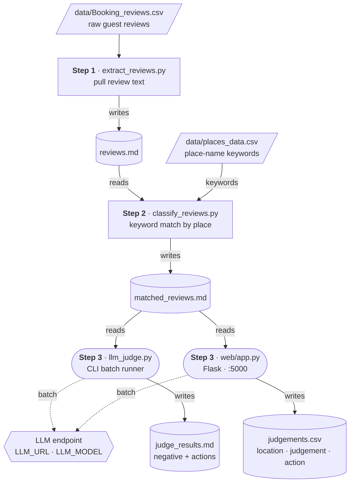

# jojani_ai

Review analysis pipeline: extract → classify → LLM judge.

## Architecture



## Project Structure

```
jojani_ai/
├── data/
│   ├── Booking_reviews.csv           # Raw reviews (source)
│   ├── booking_attractions_reviews.csv
│   └── places_data.csv              # Place name keywords
├── src/
│   ├── __init__.py
│   ├── config.py                    # Env loading, LLM settings, file paths
│   ├── llm.py                       # call_llm() — single LLM client
│   ├── prompts.py                   # Review-judgement prompt template
│   ├── parse_reviews.py             # Markdown parsers (shared)
│   ├── extract_reviews.py           # Step 1: CSV → reviews.md
│   ├── classify_reviews.py          # Step 2: Filter by place keywords
│   ├── llm_judge.py                 # Step 3 (CLI): LLM judgement → judge_results.md
│   └── web/
│       ├── __init__.py
│       ├── app.py                   # Step 3 (web): Flask routes
│       └── templates/
│           └── index.html           # Frontend (button, progress bar, results)
├── output/                          # Generated files (gitignored)
│   ├── reviews.md
│   ├── matched_reviews.md
│   ├── judge_results.md
│   └── judgements.csv
├── .env                             # LLM config (gitignored)
├── .gitignore
└── requirements.txt
```

## Prerequisites

- Python 3.10+
- Dependencies:

```bash
pip install -r requirements.txt
```

## Setup

Fill in your LLM credentials in `.env`:

```
LLM_URL=https://your-endpoint/v1/chat/completions
LLM_API_KEY=sk-your-key
LLM_MODEL=your-model-name
```

All configuration lives in `src/config.py`. Adjust `BATCH_SIZE` or `MAX_RETRIES` there if needed.

## How to Run

All CLI commands are run from the project root.

### Step 1 — Extract reviews

```bash
python -m src.extract_reviews
```

Reads `data/Booking_reviews.csv`, writes `output/reviews.md`.

### Step 2 — Classify by place name

```bash
python -m src.classify_reviews
```

Filters `output/reviews.md` for reviews mentioning places in `data/places_data.csv`, writes `output/matched_reviews.md`.

### Step 3 — LLM Judgement

**Option A — CLI:**

```bash
python -m src.llm_judge
```

Writes `output/judge_results.md` (markdown with negative reviews + action items).

**Option B — Web UI:**

```bash
python -m src.web.app
```

Then open http://localhost:5000 and click **"Run Judgement"**. Results are saved to `output/judgements.csv`:

| Column          | Description                          |
|-----------------|--------------------------------------|
| `location_name` | Place name from the review           |
| `judgement`     | One-sentence reason (why negative)   |
| `action`        | Semicolon-joined actionable fixes    |

## Configuration

| Variable (`.env`)  | Description                  |
|--------------------|------------------------------|
| `LLM_URL`          | OpenAI-compatible endpoint   |
| `LLM_API_KEY`      | API key                      |
| `LLM_MODEL`        | Model identifier             |

Runtime settings (batch size, retry count, timeout) are defined as constants in `src/config.py`.
