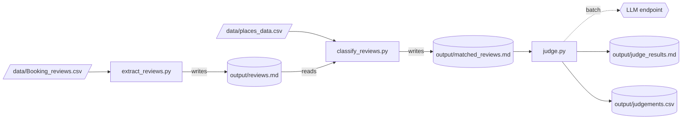

# src/ — Review Analysis Pipeline

3-step pipeline: extract → classify → LLM judge.

## Pipeline Flow



## Steps

| Step | Command | Reads | Writes |
|------|---------|-------|--------|
| 1 | `python -m src.extract_reviews` | `Booking_reviews.csv` | `output/reviews.md` |
| 2 | `python -m src.classify_reviews` | `reviews.md` + `places_data.csv` | `output/matched_reviews.md` |
| 3 (CLI) | `python -m src.llm_judge` | `matched_reviews.md` | `output/judge_results.md` |
| 3 (Web) | `python -m src.web.app` → http://localhost:5000 | `matched_reviews.md` | `output/judgements.csv` |

## Module Map

| File | Role |
|------|------|
| `config.py` | Paths, LLM env vars, batch/retry constants |
| `llm.py` | `call_llm()` — single LLM client with retry; `parse_llm_json()` — strips code fences |
| `prompts.py` | `REVIEW_JUDGE_PROMPT` template + `build_judge_prompt()` |
| `parse_reviews.py` | Markdown section parser (shared), `load_keywords()` |
| `extract_reviews.py` | Step 1: CSV → markdown |
| `classify_reviews.py` | Step 2: keyword filter |
| `judge.py` | Step 3 core: batch-judge loop (shared by CLI + web) |
| `llm_judge.py` | Step 3 CLI entry point |
| `web/app.py` | Step 3 Flask entry point |

## Markdown File Format

All intermediate files use the same structure — `## ` sections with a title line and body:

```markdown
# Title

## Section Name
body text...

## Next Section
body text...
```

`parse_reviews._parse_md_sections(path, prefix)` splits on any `## ` header; the public wrappers pick the right prefix per file type.
